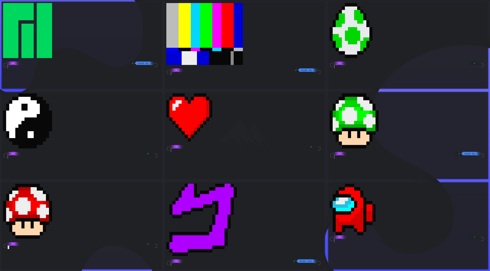

# Python Color Scripts

ASCII art for your terminal! A rework of DistroTube(Derek Taylor)'s color scripts.



Derek Taylor ([DistroTube](https://www.youtube.com/channel/UCVls1GmFKf6WlTraIb_IaJg)) has this script
called [colorscript](https://gitlab.com/dwt1/shell-color-scripts) which shows a random ASCII art when called. Most
people use it when their terminal opens. This is a modified/custom version of that idea.

# Dependencies

- python3 (theoretically, this should work with python2, but I'm not actively testing that)
- pip
- requests (automatically installed if you don't have it)

# Installation

**Note: You must have `pip` installed**

Installation is easy, just a simple one-liner.

```shell
wget -qO - https://raw.githubusercontent.com/stautonico/python-color-scripts/main/install.sh | sudo bash
```

# Updating

This script has a built-in updater.

To update, simply:

```shell
sudo python-colorscript --update
```

If a new version exists, it will automatically install.

# Usage

The simplest way to get started is just to type `python-colorscript` in your terminal to display a random artwork!

### Command Options

```shell
usage: python-colorscript [-h] [--16] [--256] [--left-padding LEFT_PADDING] [--top-padding TOP_PADDING] [--art ART]
                          [--list] [--random-color-mode] [--ignore-distro] [--blacklist BLACKLIST] [--version]
                          [--update] [--uninstall]

Draw some ASCII art!

optional arguments:
  -h, --help            show this help message and exit
  --16                  Draw in 16 colors mode
  --256                 Draw in 256 colors mode
  --left-padding LEFT_PADDING, -l LEFT_PADDING
                        Amount of space to add to the left side of the art
  --top-padding TOP_PADDING, -t TOP_PADDING
                        Amount of space to add to the top of the art
  --art ART             Draw a specific piece of art. View all using --list
  --list                List the names of all available art pieces
  --random-color-mode, -r
                        Use a random color mode
  --ignore-distro, -i   Show distro specific artworks on all distros
  --blacklist BLACKLIST, -b BLACKLIST
                        Remove specific artworks from random pool. Note: Multiple items need to be surrounded by quotes
  --add-art             Interactively add new art
  --version, -V         Show version information
  --update              Try to update to the latest version
  --uninstall           Uninstall the script from your system
```

and more secret arguments that you'll just have to discover on your own!

**Note that in the 8 and 16 color modes, your terminal's color scheme is used, which may result in strange-looking
artwork
depending on the colors you have set. For the "best" visual representation, use the 256 color mode by including `--256`
in your command**

### Recommended Use Case

You can add this file to the end of your .zshrc or .bashrc to get some ASCII artwork every time you open a terminal!

# Uninstallation

To uninstall, simply:

```shell
sudo python-colorscript --uninstall
```

Note: Uninstalling does not remove `~/.config/python-colorscript/`, so manual changes will be saved next time you install. If you wish to remove it, you can manually do so after uninstalling.

# Adding New Art

There are two ways to add new art: interactively and via a JSON file.

Regardless of the mode, you need to start by using kui's amazing [ANSI Pixels](https://kui.github.io/ansi_pixels) tool
to draw the art and get the base64 representation.

1. Navigate to [ANSI Pixels](https://kui.github.io/ansi_pixels)
2. Draw the art you want to be displayed (keep it to a smaller resolution because larger images will break on smaller
   terminals)

Now the steps change depending on which method you use.

**If you want to edit the config file directly:**

3. Copy the link generated by the site (the text above the artwork that starts with "python -c")
4. Extract the base64 portion of the link (it is the part in quotes after "ansi-pixels.py or after the '#' in the URL
   bar)"
5. Add it to the `~/.config/python-colorscript/art.json` file (use the existing artwork entries as a template)

Note: The format of `art.json` is as follows:

```json
{
  "artwork_name": {
    "8": "the base64 for the artwork in 8 color mode",
    "16": "the base64 for the artwork in 16 color mode",
    "256": "the base64 for the artwork in 256 color mode"
  }
}
```

Also, note that at least one color mode is required, but not all three need to be specified.

**Otherwise, you can launch the program with the `--add-art` flag**

5. Launch the program with the `--add-art` flag
6. Enter the name of the artwork and hit `Enter`
7. Enter the URL for the artwork in 8 color mode and hit `Enter`
8. Enter the URL for the artwork in 16 color mode and hit `Enter`
9. Enter the URL for the artwork in 256 color mode and hit `Enter`

You can add your art to this repo by submitting a pull request with your changes.

# Troubleshooting

### ZSH Completions Not Working

* Make sure `/usr/share/zsh/functions/Completion/Unix/_python-colorscript` exists
* Add `autoload -U compinit && compinit` to your `.zshrc`

### "command not found"

* Make sure you have `~/.local/bin` in your `$PATH` (the executable is installed here)
* Manually verify that `~/.local/bin/python-colorscript` exists and is executable
    * Check with `stat ~/.local/bin/python-colorscript`

# Credits

Almost none of this is my original work, so all the credit belongs to these people:

* [Derek Taylor](https://gitlab.com/dwt1/shell-color-scripts)

* [kui](https://github.com/kui/ansi_pixels)

### Art Credits

* `creeper`: [Mojang Studios](https://www.minecraft.net/en-us)
* `blackmage`: [Square Enix](https://www.square-enix.com/)
* `questionmarkblock`: [Nintendo](https://www.nintendo.com/)
* `mushroom`: [Nintendo](https://www.nintendo.com/)
* `greenmushroom`: [Nintendo](https://www.nintendo.com/)
* `sus`: [Innersloth](https://innersloth.com/)
* `bunny`: [Re-Logic](https://re-logic.com/)
* `egg`: [Nintendo](https://www.nintendo.com/)
* `menacing`: [Araki Hirohiko](https://jojo.fandom.com/wiki/Hirohiko_Araki)
* `skull`: [Stock Unlimited](https://www.stockunlimited.com/vector-illustration/pixel-art-gaming-skull-head_2022273.html)
* `megaman`: [Mega Man](https://www.capcom.com/)
* `boo`: [Nintendo](https://www.nintendo.com/)
